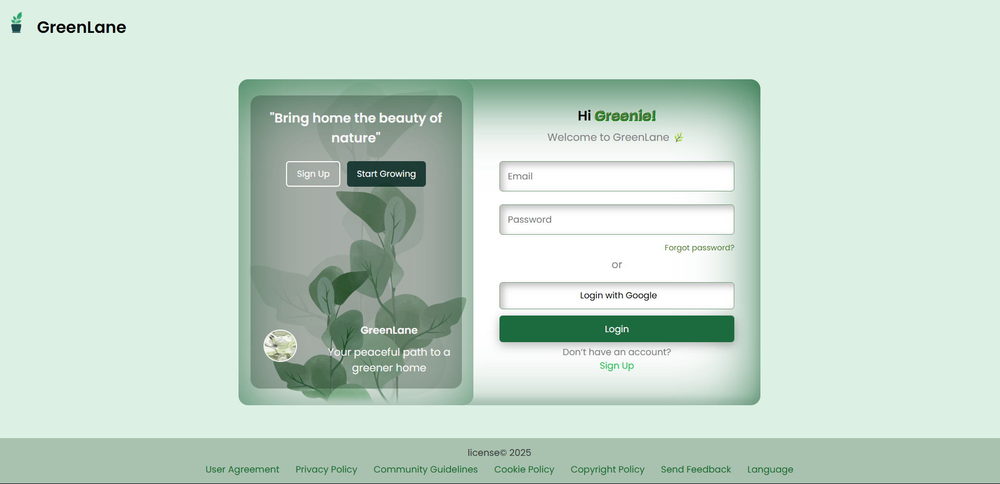

# greenlane-login-page
“🌿 A plant-themed login page UI built with HTML and CSS designed to be minimal, clean, and green! 💚.”

## 📸 Preview

> A beautiful login interface inspired by nature, featuring leaf illustrations, soothing green tones, and a refreshing layout.

---

## 🌱 Features

- Clean and responsive UI layout
- Nature/plant-inspired theme
- Leafy illustrations and green palette
- Pure HTML & CSS (no frameworks)
- Beginner-friendly structure

---

## 📁 Project Structure
greenlane-login-page/
│
├── index.html         # Main login page
├── style.css          # All styling rules
└── images/            # All plant and leaf themed illustrations
├── leafy.jpeg
├── plantpng2.png
├── sikers.jpeg
└── leaf-gradient-illustration-design.png

---

## 🚀 How to Use

1. Clone or download this repository  
2. Open `index.html` in any browser  
3. Customize as you like – it's your leafy garden now! 🌼

---

## 🔮 Future Updates

Here are some planned or potential improvements:

- [ ] Make the layout fully responsive for mobile 📱  
- [ ] Add simple JavaScript validation on the login form 🔐  
- [ ] Add hover animations and transitions 🍃  
- [ ] Include a "Forgot Password" and "Sign Up" link  
- [ ] Dark Mode toggle 🌑  
- [ ] Deploy with GitHub Pages or Netlify for live demo 🌍  

Feel free to suggest more by opening an issue or pull request!

---

## ✨ Demo

You can deploy it using **GitHub Pages** to see it live:  
> **Settings → Pages → Deploy from `main` → `/root`**

*(Need help? Let me know!)*

---

## 🧑‍💻 Author

**Shreya Mathur**  
🌐 GitHub: [shreya03-m](https://github.com/shreya03-m)

---

## 🪴 License

This project is open-source and free to use.  
Feel free to 🌱 fork and grow it into your own creative UI!

